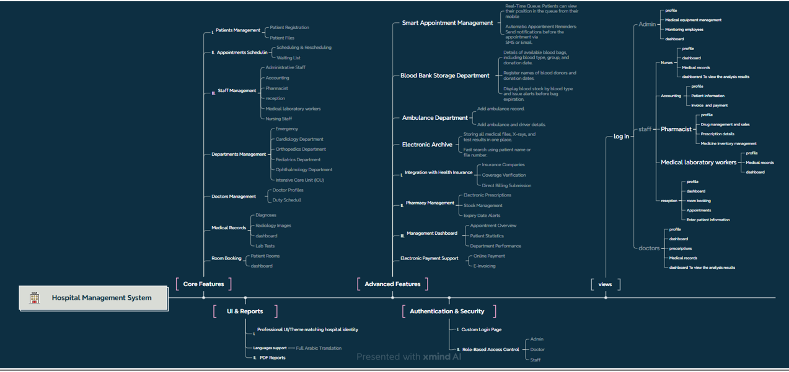
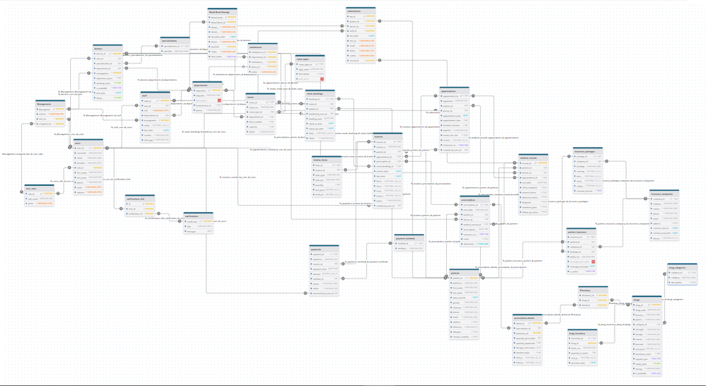

# The Healing HMS

## Project Overview
**The Healing HMS** is a comprehensive Hospital Management System (HMS) designed to streamline hospital operations and improve patient care. The system covers key modules including:

- Patient Management  
- Appointment Scheduling  
- Doctor & Staff Management  
- Pharmacy Management  
- Electronic Payment Integration  
- Health Insurance Integration  

## Purpose
The project aims to provide a user-friendly platform for hospital staff and administration to manage workflows efficiently, ensuring smooth operations and better service quality.

## Project Structure
- **Modules:** Each module addresses specific hospital functionalities.  
- **Database:** Centralized storage for all hospital-related data.  
- **XMind Diagram:** Visual representation of the system structure and module relationships.  

## Team Members
- **Aliaa (Team Leader):** Project coordination, Gantt chart, documentation  
- **Lama:** XMind diagram and module overview  
- **Mariam:** Database diagram and data modeling  

## Current Status
- Initial project setup completed  
- XMind diagram created and finalized  
- Database diagram designed and verified  
- Repository linked and ready for ongoing development  

## Next Steps
- Develop individual modules in Odoo  
- Implement workflows and integrate features  
- Continuous testing and documentation updates

## Project Diagrams 

### 1. XMind Diagram
**Description:** This diagram shows the overall system structure, modules, and their relationships.  
  
[Open Diagram Website](https://xmind.ai/share/tJiUEGEF)

### 2. Database ERD
**Description:** This diagram illustrates the database schema, tables, and their relationships.  
  
[Open Database ERD Website](https://www.drawdb.app/editor?shareId=c7e2748cc6e388448c9ae9a72163d3cf)

## Instructions for Commit & Push
Please follow the steps in  to create your branch, commit changes, and submit a Pull Request.

